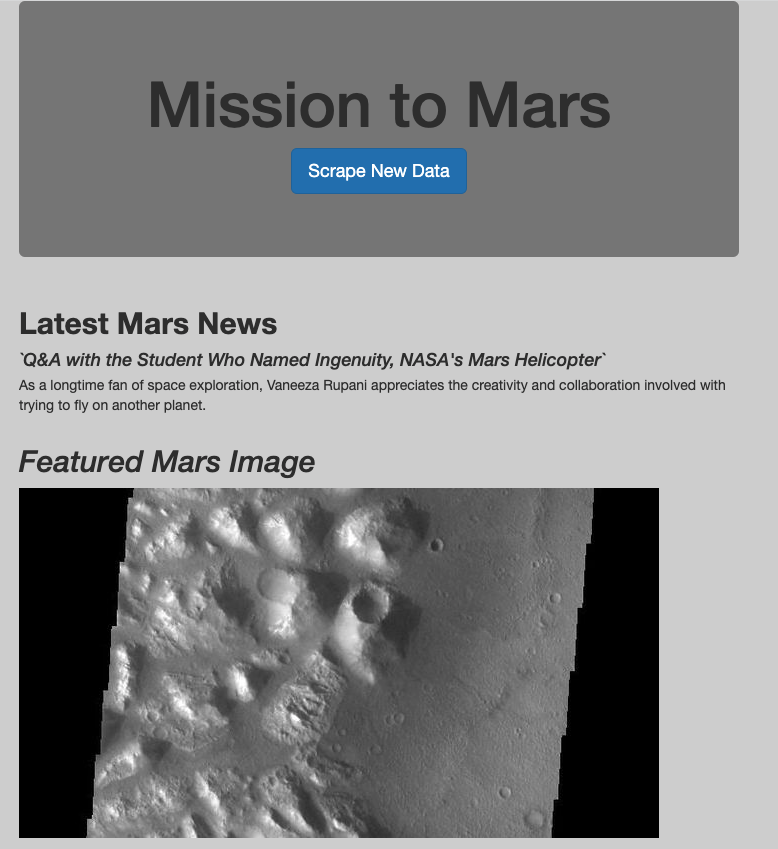
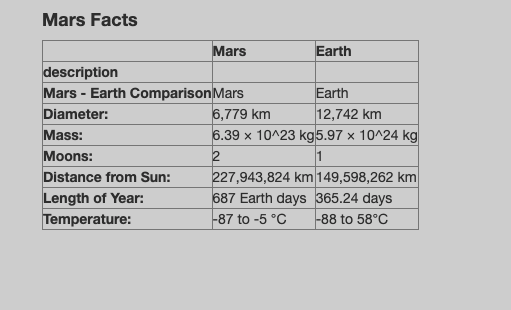
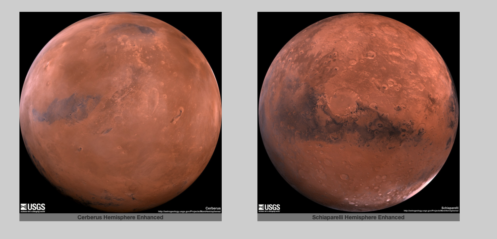
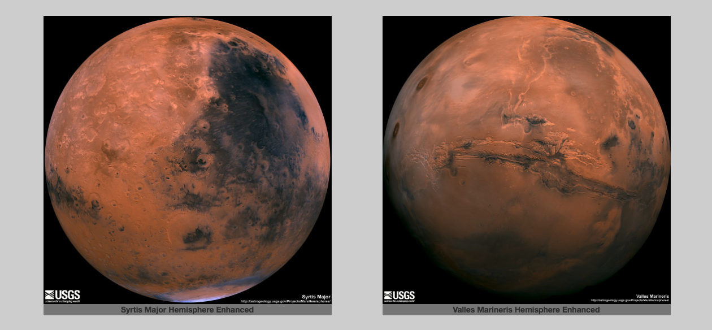

# Mission-to-Mars
Web Scraping and Data storing and display. 

## Overview of Project: 
In this analysis, we created a python script to scrape data from different website sources that we combined into our own site. We used BeautifulSoup and Splinter to scrape information about Mars from different sites including current News headlines, facts and statistic for a table, and images of the surface and of each of the 4 hemispheres. We then stored the scraped data on a Mongo database and used a Flask web application to display the data, and modify the design and formatting of the application using Bootstrap. The information on the Mission to Mars site can be updated by clicking the "Scrape New Data" botton on the homepage. 

### Websites Scraped: 
- https://redplanetscience.com
- https://spaceimages-mars.com
- https://galaxyfacts-mars.com
- https://astrogeology.usgs.gov/search/results?q=hemisphere+enhanced&k1=target&v1=Mars%22

## Mission to Mars:

    

   

    

    
